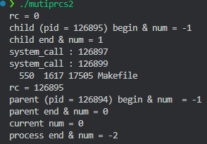
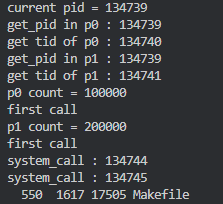

# 1.1 fork() 系统调用示例程序

## 介绍  
本程序演示了 Unix/Linux 系统中 `fork()` 系统调用的基本用法。`fork()` 用于创建一个新进程（子进程），它是多进程编程的基础。程序通过父进程和子进程各自打印进程 ID（PID）来展示 `fork()` 的执行结果。

---

## 功能  
- 使用 `fork()` 创建一个子进程。  
- 父进程和子进程分别打印自己的 **进程 ID (PID)** 和 `fork()` 返回值。  
- 通过 `getpid()` 获取当前进程的 PID。


---

# 编译与运行  


使用 `cmake` 编译源代码：  
```bash
cd build
make mutiprcs1
./mutiprcs1
```

---

## 运行结果


---

# 1.2 fork、exec 和 system 调用示例程序

## 介绍

本程序展示了 **`fork()`**、**`execvp()`** 和 **`system()`** 系统调用的结合使用，通过创建子进程和执行外部命令，演示了进程控制与外部命令调用的基本原理。

---

## 功能

1. **创建子进程**  
   使用 `fork()` 创建一个子进程，子进程和父进程分别执行不同的代码块。  

2. **执行外部程序**  
   - 子进程调用 `system()` 执行一个外部程序 `./system_call`。  
   - 使用 `execvp()` 执行命令 `wc Makefile`。  

3. **进程变量的独立性**  
   - 变量 `num` 被修改，展示了父子进程之间变量的独立性。  

4. **父进程等待子进程结束**  
   使用 `wait(NULL)` 确保父进程等待子进程的执行完成。

---


## 编译与运行

### 1. 编译  
使用 `gcc` 编译源代码：  
```bash
cd build
make mutiprcs2
./mutiprcs2
```


---

## 输出示例



### 输出说明  
- `child` 和 `parent` 分别打印进程的执行结果。  
- `system()` 执行 `./system_call` 程序的输出会在子进程中显示。  
- `execvp()` 替换子进程映像为 `wc Makefile` 命令，输出 `Makefile` 文件的行数、单词数和字符数。  

---

## 注意事项

1. **`system_call` 文件**  
   确保当前目录下存在可执行的 `system_call` 文件，否则 `system()` 会失败。

2. **`execvp()` 调用**  
   - 执行 `execvp()` 后，子进程的映像会被替换，不再执行后续代码。  
   - 若 `wc` 命令执行失败，需要检查 `Makefile` 文件是否存在。

3. **`wait()` 的作用**  
   父进程等待子进程结束，确保父进程的输出在子进程之后。

---

# 1.3 多线程实验程序

## 实验内容

本实验演示了以下内容：

1. **创建两个线程**  
   在主进程中创建两个线程，并对共享变量进行操作。

2. **线程对共享变量的操作**  
   每个线程对共享变量 `count` 进行 100,000 次加法操作，同时输出当前线程的 PID 和 TID。

3. **线程中的外部命令调用**  
   在线程中调用 `system()` 和 `execvp()` 执行外部程序，观察系统调用的行为。

4. **互斥锁的使用**  
   通过 **互斥锁 (mutex)** 保证共享变量的同步和互斥访问，解决竞态条件问题。

5. **进程与线程 ID 的比较**  
   使用 `getpid()` 和 `syscall(SYS_gettid)` 来获取进程 ID 和线程 ID，分析它们的区别。

---

## 功能实现

### 代码功能点

- **共享变量初始化**：变量 `count` 被初始化为 `0`。
- **两个线程操作**：  
   - 每个线程对变量 `count` 循环加 `1` 100,000 次。  
   - 使用互斥锁 `pthread_mutex_t` 控制变量访问，确保数据同步。  
- **系统调用**：  
   - 使用 `system("./system_call")` 执行外部程序 `system_call`。  
   - 使用 `execvp()` 执行 `wc Makefile` 命令。  
- **线程 ID 与进程 ID 比较**：通过 `getpid()` 和 `syscall(SYS_gettid)` 输出线程和进程的标识符。

---

## 编译与运行

### 1. 编译

使用 GCC 编译程序：

```bash
cd build
make concurrency
./concurrency
```

---

## 输出示例

运行结果示例如下：



---

## 结果分析

1. **线程和进程 ID 的比较**  
   - 通过 `getpid()` 获取的进程 ID 在两个线程中相同，说明线程共享同一个进程地址空间。  
   - 通过 `syscall(SYS_gettid)` 获取的线程 ID 不同，说明每个线程有独立的线程标识符 (TID)。  

2. **共享变量 `count` 的同步**  
   - 如果没有使用互斥锁 `pthread_mutex_t`，共享变量 `count` 会因为竞态条件而导致结果不一致。  
   - 使用互斥锁后，确保了线程对变量 `count` 的安全访问，结果始终正确。  

3. **`system()` 与 `execvp()` 的区别**  
   - `system()` 会创建子进程执行外部命令，执行完成后返回。  
   - `execvp()` 替换当前进程映像，导致后续代码不会执行。  

---

## 问题与解决方案

### 问题1：竞态条件

- **现象**：多次运行程序时，结果 `count` 会不一致。  
- **原因**：线程并发访问共享变量时，没有同步机制，导致数据竞争。  
- **解决方案**：  
   - 使用互斥锁 (`pthread_mutex_lock` 和 `pthread_mutex_unlock`) 保护临界区。  

### 问题2：`execvp()` 替换进程映像

- **现象**：`execvp()` 执行后，线程的代码无法继续执行。  
- **原因**：`execvp()` 调用会替换当前进程映像，不会返回。  
- **解决方案**：确保 `execvp()` 位于程序的最后，或者使用 `fork()` 创建子进程执行 `execvp()`。

--- 


# 自定义锁实现与多线程计数程序

## 实验内容

本实验实现了一个 **自定义锁**（`lock_t`），用于保护共享资源，确保多线程环境下数据同步和一致性。

---

## 功能描述

1. **自定义锁的实现**  
   - 使用 **Test-And-Set** 原子操作（`__sync_lock_test_and_set`）实现自旋锁。  
   - 锁提供以下操作：  
     - `init(lock_t *lock)`：初始化锁。  
     - `lock(lock_t *lock)`：加锁操作，进入自旋等待。  
     - `unlock(lock_t *lock)`：解锁操作，释放锁。  

2. **共享变量计数**  
   - 通过两个线程对共享变量 `count` 进行并发递增操作，每个线程执行 100,000 次加法操作。  
   - 使用自定义锁保护对共享变量的访问，避免竞态条件。

3. **多线程创建与同步**  
   - 使用 `pthread_create` 创建两个线程执行递增操作。  
   - 使用 `pthread_join` 等待两个线程完成任务。  

---


## 编译与运行


```bash
cd build
make lock
./lock
```

---

## 输出示例


**说明**：  
- 两个线程分别执行累加操作，最终结果为 200,000，验证了自定义锁的正确性。

---

## 结果分析

1. **共享资源保护**  
   - 自定义锁确保了对共享变量 `count` 的互斥访问，避免了竞态条件。  
   - 两个线程在临界区执行时不会发生数据冲突，最终结果是稳定且正确的。

2. **Test-And-Set 操作**  
   - `__sync_lock_test_and_set` 是一个原子操作，它用于实现自旋锁，保证线程安全。  
   - 当一个线程获取锁时，其他线程进入自旋等待，直到锁被释放。

3. **多线程同步**  
   - 使用 `pthread_join` 等待两个线程执行完成，保证主线程在子线程结束后再退出。


---

# 许可证
该代码仅供学习使用，欢迎修改和使用。

