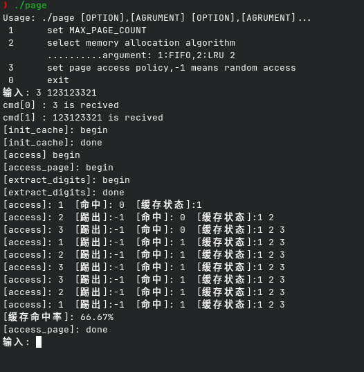

# 2.1

该程序演示了使用 `fork()` 和自定义信号处理器在父子进程中处理信号的场景。父进程创建两个子进程，并根据用户输入发送信号。程序使用自定义信号 `SIGEND1` 和 `SIGEND2` 来终止子进程，并处理如 `SIGINT`、`SIGQUIT` 和 `SIGALRM` 等信号。

## 功能
- 创建两个子进程并发送自定义信号。
- 父进程处理信号并向子进程发送终止信号。
- 子进程打印接收到的信号并相应终止。

## 编译和运行

编译并运行程序：

```bash
cd build
cmake ..
make signal
./signal
```

## 工作原理
1. 父进程 (`[p]`) 等待信号（`SIGINT`、`SIGQUIT`、`SIGALRM`）的触发。
2. 当父进程接收到信号时，它向第一个子进程发送 `SIGEND1`，向第二个子进程发送 `SIGEND2`。
3. 子进程 (`[c1]` 和 `[c2]`) 为 `SIGEND1` 和 `SIGEND2` 配置了各自的信号处理程序，打印消息并终止进程。
4. 使用 `signal()` 函数设置每个信号的处理程序。

## 注意事项
- 使用 `signal()` 函数为每个信号类型设置处理程序。
- `alarm(5)` 函数使父进程在5秒内等待信号。
- 该程序展示了如何在类 UNIX 系统中使用信号来控制进程流。
  
## 运行结果展示

# 2.2道与进程同步

该程序使用管道和进程间同步（通过 `lockf`）在父子进程间进行数据传输。父进程创建两个子进程，每个子进程向管道中写入数据，并使用文件锁来控制写入顺序。

## 功能
- 创建一个管道，用于在父子进程之间传递数据。
- 使用 `lockf()` 来同步进程，确保两个子进程按顺序向管道写入数据。
- 父进程等待子进程结束并读取管道中的数据。

## 编译与运行

编译并运行程序：

```bash
cd build
cmake ..
make pipe
./pipe
```
## 运行结果展示

# 2.3内存分页访问策略

该程序模拟了内存分配的三种策略，能够模拟创建进程和终止进程的内存行为

## 功能
- 模拟了内存分配的三种策略
- 能够模拟创建进程和终止进程的内存行为
- 展示内存使用情况

## 编译与运行

编译并运行程序：

```bash
cd build
cmake ..
make memory
./memory
```
## 运行结果展示


# 2.4页面缓存模拟

本程序模拟了一个页面缓存，支持两种内存管理算法（FIFO和LRU）。用户可以配置最大缓存页面数、选择内存管理算法，并模拟页面访问。程序还支持随机页面访问模式。

## 功能

- **页面缓存模拟**：使用链表实现缓存和页面结构。
- **页面替换算法**：
  - **FIFO（先进先出）**：页面按添加顺序进行替换。
  - **LRU（最近最少使用）**：根据最久未访问的页面进行替换。
- **随机页面访问**：可以生成随机页面号来测试缓存行为。
- **缓存命中率计算**：在一系列访问后，显示缓存的命中率。

## 结构

### `page_t`
表示缓存中的一个页面，包含以下字段：
- `vpn`：虚拟页面号（VPN）。
- `length`：页面在缓存中的位置（用于FIFO算法）。
- `next`：指向下一个页面的指针（用于链表结构）。

### `cache_t`
表示页面缓存，包含以下字段：
- `head`：指向缓存中第一个页面的指针。
- `tail`：指向缓存中最后一个页面的指针。

### `access_t`
表示一次访问请求，包含以下字段：
- `digits`：存储页面号各个数字的数组（用于模拟访问）。
- `size`：`digits`数组中的数字个数。

## 函数

### `generate_random_int()`
生成一个六位或更大的随机整数。该函数用于模拟随机页面访问。

### `extract_digits(int number)`
提取一个数字的各位数字，并将它们存储到数组中。用于模拟从随机数字提取页面访问序列。

### `print_cache(const cache_t *cache)`
打印缓存的当前状态，显示缓存中的所有页面。

### `init_cache()`
初始化缓存，分配内存并将缓存头和尾指针设置为NULL。

### `init_page_count(int count)`
设置缓存中页面的最大数量。

### `init_mmu_algo(int choice)`
选择内存管理算法：
- `1` 为FIFO算法
- `2` 为LRU算法

### `fifu(int pn)`
模拟FIFO（先进先出）算法的页面访问。处理缓存命中和页面替换。

### `lru(int pn)`
模拟LRU（最近最少使用）算法的页面访问。处理缓存命中和页面替换。

### `access_page(int nums)`
模拟页面访问，根据提取的数字序列进行缓存访问，并根据访问情况计算缓存的命中率。

### `help()`
显示程序的使用说明。

### `parse_command(char *input)`
解析用户输入的命令并执行相应的函数，包括设置最大页面数、选择内存管理算法或模拟页面访问。

### `main()`
程序的主入口。不断接受用户输入，处理命令并根据用户选择模拟页面缓存访问。

## 使用方法

### 命令格式
1. 设置缓存中页面的最大数量：
   ```
   1 <MAX_PAGE_COUNT>
   ```

2. 选择内存管理算法：
   - `1` 选择FIFO算法
   - `2` 选择LRU算法
   ```
   2 <ALGORITHM_NUMBER>
   ```

3. 访问页面：
   - 输入页面号进行模拟访问（或者输入 `-1` 来随机生成页面号）：
   ```
   3 <PAGE_NUMBER>
   ```

4. 退出程序：
   ```
   0
   ```

## 展示



## 编译与执行

1. **编译程序：**
   ```
   gcc -o page page_cache_simulation.c
   ```

2. **运行程序：**
   ```
   ./page
   ```


# 许可证
该代码仅供学习使用，欢迎修改和使用。


