# 二级文件系统模拟程序

## 介绍  

这是一个用 C 语言实现的模拟二级文件系统的程序，提供了文件和目录管理功能。通过简单的命令，用户可以实现类似 Unix 系统中的文件操作，如创建、删除、打开、关闭、读写文件，管理目录，以及用户登录登出等功能。

---

## 功能  
程序提供了以下 18 个功能命令：

| 序号 | 功能描述                   | 命令格式                          |
|------|----------------------------|-----------------------------------|
| 1    | 更改当前目录               | `cd $path/to/dir$`                |
| 2    | 修改文件/目录权限           | `chmod $name$ $rwx$`              |
| 3    | 创建新目录                 | `mkdir $dir_name$`                |
| 4    | 删除空目录                 | `rmdir $dir_name$`                |
| 5    | 删除目录及其所有内容       | `rmdir -r $dir_name$`             |
| 6    | 打开文件                   | `open $file_name$`                |
| 7    | 关闭文件                   | `close $file_name$`               |
| 8    | 写入文件（覆盖/追加）       | `write $file_name$ >/>> $content$`|
| 9    | 读取文件内容               | `read $file_name$`                |
| 10   | 创建文件                   | `mkf $file_name$`                 |
| 11   | 删除文件                   | `rm $file_name$`                  |
| 12   | 用户登录                   | `login`                           |
| 13   | 用户登出                   | `logout`                          |
| 14   | 修改用户密码               | `passwd`                          |
| 15   | 退出程序                   | `quit`                            |
| 16   | 列出当前目录下的文件和目录 | `ls`                              |
| 17   | 格式化磁盘                 | `format`                          |
| 18   | 查看帮助信息               | `help`                            |

---

## 命令示例  

### 1. **目录操作**
- **更改目录**  
  ```shell
  cd d
  ```
  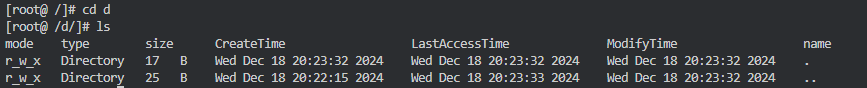
- **创建目录**  
  ```shell
  mkdir d
  ```
  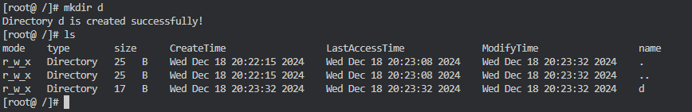
- **删除目录（包含所有内容）**  
  ```shell
  rmdir d
  ```
  

### 2. **文件操作**
- **创建文件**  
  ```shell
  mkf f
  ```
  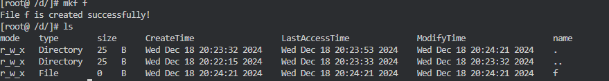
- **打开文件**  
  ```shell
  open f
  ```
  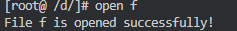
- **写入文件**（覆盖内容）  
  ```shell
  write f > hhh!
  ```
  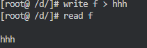
- **追加写入文件**  
  ```shell
  write f >> xxx
  ```
  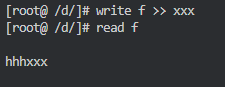
- **读取文件内容**  
  ```shell
  read f
  ```
  
- **关闭文件**  
  ```shell
  close f
  ```
  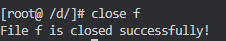
- **删除文件**  
  ```shell
  rm f
  ```
  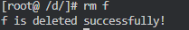

### 3. **权限管理**
- **修改权限**  
  ```shell
  chmod f rwx
  ```
  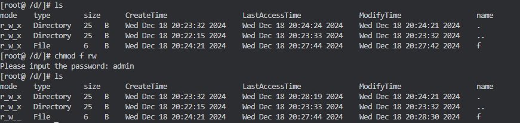

### 4. **用户管理**
- **登录系统**  
  ```shell
  login
  ```
  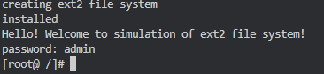
- **登出系统**  
  ```shell
  logout
  ```
  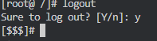
- **修改密码**  
  ```shell
  passwd
  ```
  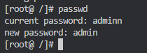

### 5. **磁盘操作**
- **格式化磁盘**  
  ```shell
  format
  ```
  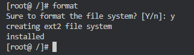
### 6. **查看帮助**
- **显示帮助信息**  
  ```shell
  help
  ```
  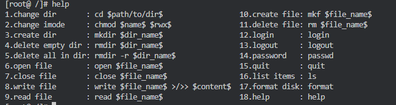
---

## 使用说明  
1. **启动程序**：  
   在命令行中编译并运行程序。例如：  
   ```shell
   gcc -o fs fs_sim.c
   ./fs
   ```

2. **输入命令**：  
   在程序运行后，根据需要输入上述命令进行文件系统操作。

3. **退出程序**：  
   使用 `quit` 命令退出文件系统。

---

## 未来改进方向  
- 增加文件系统持久化功能，数据保存在磁盘文件中。  
- 提供更细致的用户权限管理系统（如多用户角色）。  
- 增强错误处理机制，提升系统的稳定性。

---

# 许可证
该代码仅供学习使用，欢迎修改和使用。


